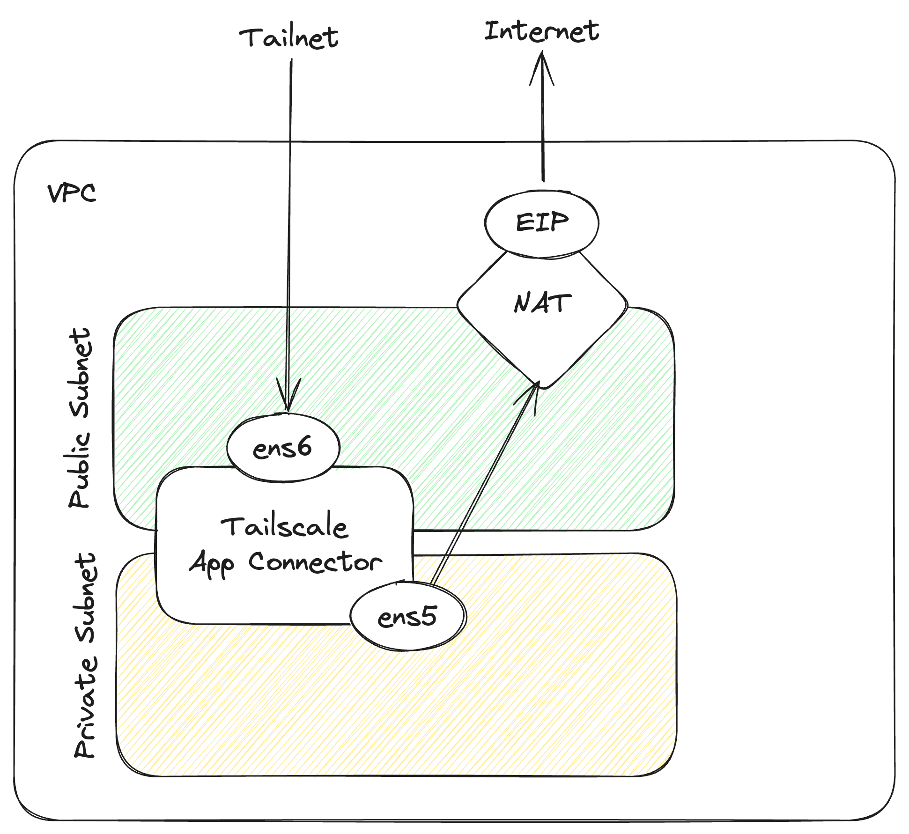

# aws-ec2-autoscaling-dual-subnet

> :information_source: This example is intended for users that have a AWS NAT Gateway that they specifically
want to route Internet-bound traffic through. A use case for this is if you have _static IP addresses_ (typically Elastic IPs)
that you want or need to use for all Internet-bound traffic such as restricting access to GitHub or Snowflake
to a custom allow-list of IP addrresses.



This module creates the following:

- a VPC and related resources including a NAT Gateway
- two AWS Elastic Network Interfaces (ENI) - one for a public subnet and one for a private subnet
- an EC2 Launch Template using both ENIs and a userdata script to install and configure Tailscale
  - the userdata script also configures custom routing on the instance to allow direct connections to the instance
  through the public subnet and outgoing connectivity through the VPC's NAT Gateway
- an EC2 Autoscaling Group using the Launch Template with `min_size`, `max_size`, and `desired_capacity` set to `1`
- a Tailnet device key to authenticate instances launched by the ASG to your Tailnet

## Considerations

- The Auto Scaling Group does not define an `instance_refresh` policy as the ASG cannot do a rolling restart with externally manaaged network interfaces (ENIs) as required by this configuration. To update instances to the latest launch template, terminate instances in the ASG in the AWS Console or programmatically. This will release the ENI so the replacement instance can use it.
- Any advertised routes and exit nodes must still be approved in the Tailscale Admin Console. The code can be updated to use [Auto Approvers for routes](https://tailscale.com/kb/1018/acls/#auto-approvers-for-routes-and-exit-nodes) if this is configured in your ACLs.

## To use

Follow the documentation to configure the Terraform providers:

- [Tailscale](https://registry.terraform.io/providers/tailscale/tailscale/latest/docs)
- [AWS](https://registry.terraform.io/providers/hashicorp/aws/latest/docs)

### Deploy

```shell
terraform init
terraform apply
```

## To destroy

```shell
terraform destroy
```
