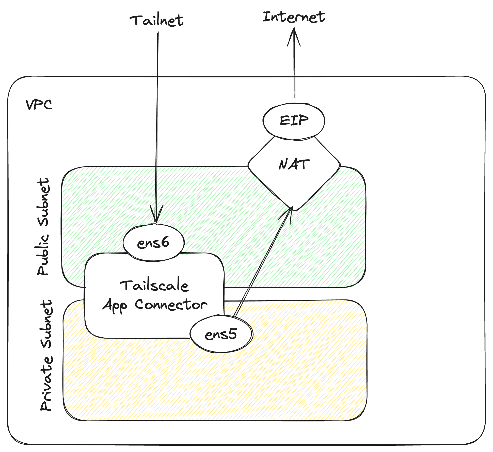

# aws-ec2-autoscaling-dual-subnet

> :information_source: This example is intended for users that have a AWS NAT Gateway that they specifically
want to route Internet-bound traffic through. A use case for this is if you have _static IP addresses_ (typically Elastic IPs)
that you want or need to use for all Internet-bound traffic such as restricting access to GitHub or Snowflake
to a custom allow-list of IP addrresses.



This module creates the following:

- a VPC and related resources including a NAT Gateway
- multiple AWS Elastic Network Interfaces (ENI) pairs - one public and one private per potential instance
- EC2 Launch Templates using specific ENI pairs and a userdata script to install and configure Tailscale
  - the userdata script also configures custom routing on the instance to allow direct connections to the instance
  through the public subnet and outgoing connectivity through the VPC's NAT Gateway
- individual EC2 Autoscaling Groups for each instance slot with `min_size`, `max_size`, and `desired_capacity` set to `1` per ASG
- a Tailnet device key to authenticate instances launched by the ASG to your Tailnet

## Scaling Configuration

The module now supports scaling by creating multiple ENI pairs and individual ASGs for each instance. Key variables:

- `max_instances`: Maximum number of instances that can be created (default: 3)
- `desired_capacity`: Number of instances to run initially (default: 1)
- `instance_type`: EC2 instance type (default: "c7g.medium")

### How Scaling Works

1. **ENI Pre-creation**: The module creates `max_instances` pairs of ENIs (public + private)
2. **Individual ASGs**: Each potential instance gets its own ASG with dedicated ENI pair
3. **Dynamic Activation**: ASGs are activated based on `desired_capacity`

Example ENI assignment for `max_instances = 3`:
- Instance 1: ENI-primary-1 (public) + ENI-secondary-1 (private)
- Instance 2: ENI-primary-2 (public) + ENI-secondary-2 (private)  
- Instance 3: ENI-primary-3 (public) + ENI-secondary-3 (private)

## Considerations

- **ENI Management**: ENIs are pre-created and managed externally to the ASGs. Each instance gets a dedicated pair.
- **No Rolling Updates**: The ASGs cannot do rolling restarts with externally managed network interfaces (ENIs). To update instances to the latest launch template, terminate instances in the AWS Console or programmatically.
- **Cost**: Pre-creating ENIs incurs costs even when instances aren't running. Consider adjusting `max_instances` based on your scaling needs.
- **Scaling Limitations**: To scale beyond `max_instances`, you must update the Terraform configuration and apply changes.
- Any advertised routes and exit nodes must still be approved in the Tailscale Admin Console. The code can be updated to use [Auto Approvers for routes](https://tailscale.com/kb/1018/acls/#auto-approvers-for-routes-and-exit-nodes) if this is configured in your ACLs.

## To use

Follow the documentation to configure the Terraform providers:

- [Tailscale](https://registry.terraform.io/providers/tailscale/tailscale/latest/docs)
- [AWS](https://registry.terraform.io/providers/hashicorp/aws/latest/docs)

### Deploy

```shell
terraform init

# Deploy with default settings (1 instance)
terraform apply

# Deploy with custom scaling
terraform apply -var="desired_capacity=2" -var="max_instances=5"
```

### Scaling Operations

To scale up:
```shell
terraform apply -var="desired_capacity=3"
```

To scale down:
```shell
terraform apply -var="desired_capacity=1"
```

## To destroy

```shell
terraform destroy
```
