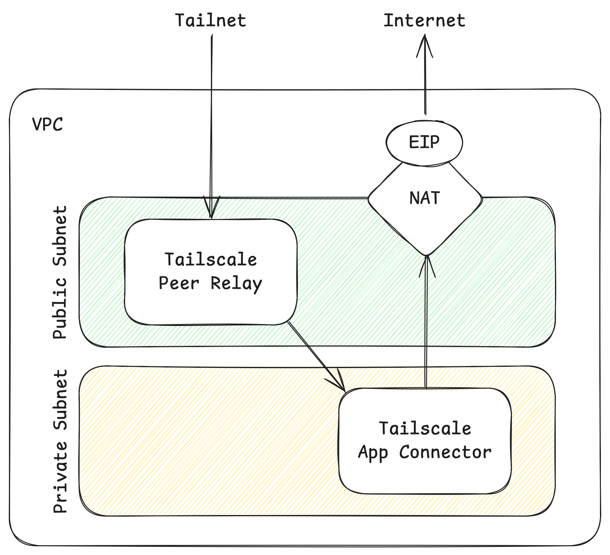

# aws-ec2-autoscaling-relay-to-private-subnet

> :information_source: This example is intended for users that have a AWS NAT Gateway that they need to route Internet-bound traffic through. A use case for this is if you have _static IP addresses_ (typically Elastic IPs) that need to use for Internet-bound traffic such as restricting access to GitHub or Snowflake to a custom allow-list of IP addrresses. AWS NAT Gateway is a Hard NAT which forces [DERP connections](https://tailscale.com/kb/1257/connection-types#derp-connections). This example deploys a [Peer Relay](https://tailscale.com/kb/1591/peer-relays) to a Public Subnet to relay traffic to an App Connector in a Private Subnet.



This module creates the following:

- a VPC and related resources including a NAT Gateway, a public subnet, and a private subnet
- an EC2 Launch Template and Autoscaling Group for a Tailscale Peer Relay in the **_public_** subnet
- an EC2 Launch Template and Autoscaling Group for a Tailscale App Connector in the **_private_** subnet

## Policy File Example

```json
{
    "grants": [
		//////////////
		// Peer relays
		//////////////
		{
			"src": ["tag:example-infra"],
			"dst": ["tag:example-relay"],
			"app": {
				"tailscale.com/cap/relay": [],
			},
		},
    ]
}
```

## Considerations

- Any advertised routes for the App Connector must still be approved in the Tailscale Admin Console. The code can be updated to use [Auto Approvers for routes](https://tailscale.com/kb/1018/acls/#auto-approvers-for-routes-and-exit-nodes) if this is configured in your ACLs.

## To use

Follow the documentation to configure the Terraform providers:

- [Tailscale](https://registry.terraform.io/providers/tailscale/tailscale/latest/docs)
- [AWS](https://registry.terraform.io/providers/hashicorp/aws/latest/docs)

### Deploy

```shell
terraform init
terraform apply
```

## To destroy

```shell
terraform destroy
```
